# Time Synchronization Problems Troubleshooting Guide

> One of the most underestimated causes of production outages.
>
> The hidden dependency behind TLS certificates, distributed databases, Kubernetes clusters, authentication systems, monitoring platforms, cloud services, and financial systems.
>
> A topic that teaches distributed systems, Linux internals, networking, security, and infrastructure engineering.

---

# Why This Exists

Most engineers think:

```text
Time Is Just A Clock
```

Reality:

```text
Time Is Infrastructure
```

Modern systems depend on accurate time for:

```text
TLS Certificates
JWT Tokens
Kerberos Authentication
Databases
Distributed Systems
Logs
Monitoring
Backups
Cloud Services
Kubernetes
```

When time becomes incorrect:

```text
Authentication Fails
Certificates Break
Clusters Become Unstable
Logs Become Useless
Replication Breaks
```

Entire systems can fail.

---

# Problem It Solves

Imagine a company with offices worldwide.

Every office records:

```text
Meetings
Transactions
Events
Payments
```

If every office uses a different clock:

```text
Event Ordering Breaks

Auditing Becomes Impossible

Trust Disappears
```

Distributed systems face exactly this challenge.

---

# Mental Model

Most beginners think:

```text
Time = Clock On Screen
```

Engineers think:

```text
Time = Operating System Service
```

Senior engineers think:

```text
Time = Distributed Consensus Approximation
```

Because in computing:

```text
Nobody Truly Knows The Exact Time
```

Systems continuously estimate it.

---

# First Principles

Computers have:

```text
Hardware Clock (RTC)
Software Clock (System Time)
```

---

# Time Architecture

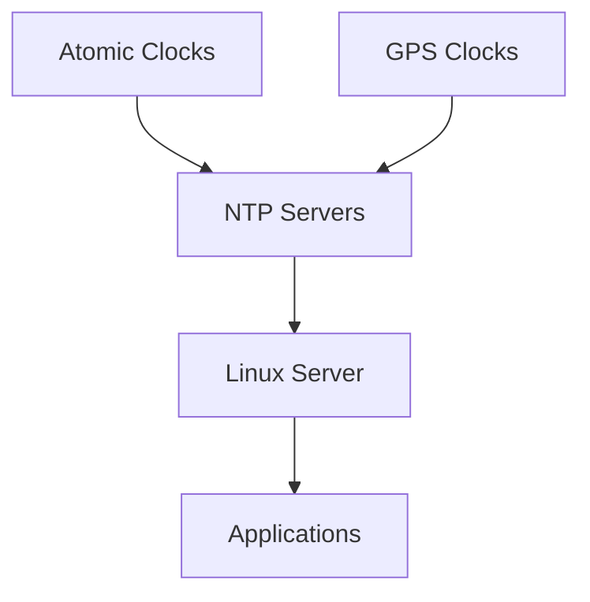

Your server's time ultimately originates from:

```text
Atomic Clocks
```

located somewhere else on Earth.

---

# What Is Time Synchronization?

The process of:

```text
Aligning System Clock
With Reference Time Source
```

Usually via:

```text
NTP
Chrony
systemd-timesyncd
```

---

# Why Time Matters

Many systems assume:

```text
All Machines Agree On Time
```

When they do not:

```text
Chaos Happens
```

---

# Distributed Systems View

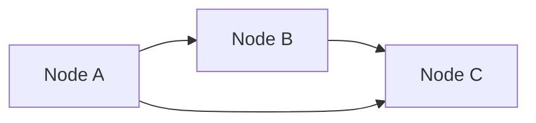

If clocks differ:

```text
Event Ordering Becomes Uncertain
```

---

# The Golden Rule

Never ask:

```text
Why Is Authentication Failing?
```

Ask:

```text
Could Time Be Wrong?
```

Because time issues often masquerade as:

```text
TLS Errors
Login Failures
Database Errors
Kubernetes Problems
```

---

# Common Symptoms

```text
Certificate Expired
Certificate Not Yet Valid
JWT Validation Failure
Kerberos Failure
Replication Failure
Node Not Ready
Monitoring Gaps
Log Timestamp Problems
```

---

# How Linux Tracks Time

Linux maintains:

```text
Real Time Clock (RTC)

System Clock
```

---

# Clock Architecture

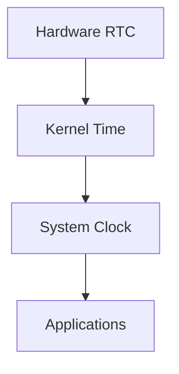

---

# Real Time Clock (RTC)

Hardware component.

Continues running even when:

```text
Server Powered Off
```

---

# System Clock

Loaded during boot.

Used by:

```text
Applications
Logs
Networking
Security Systems
```

---

# Viewing Time

Check:

```bash
date
```

Check RTC:

```bash
hwclock
```

Check status:

```bash
timedatectl
```

---

# Time Synchronization Architecture

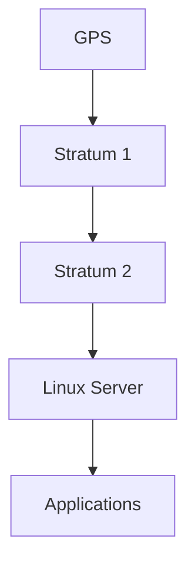

---

# Understanding NTP

NTP:

```text
Network Time Protocol
```

Purpose:

```text
Synchronize Clocks
Across Networks
```

---

# NTP Hierarchy

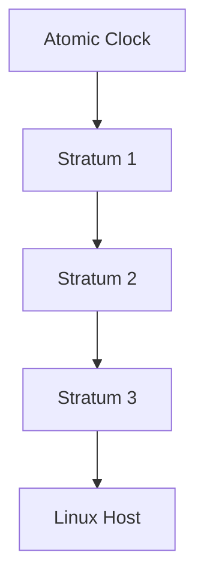

---

# What Is Stratum?

Distance from reference clock.

```text
Stratum 0 = Atomic Clock

Stratum 1 = Directly Connected

Stratum 2 = Syncs To Stratum 1

Stratum 3 = Syncs To Stratum 2
```

Lower is generally better.

---

# Failure 1: NTP Service Down

Most common issue.

Check:

```bash
systemctl status chronyd
```

or:

```bash
systemctl status systemd-timesyncd
```

---

# Failure Flow

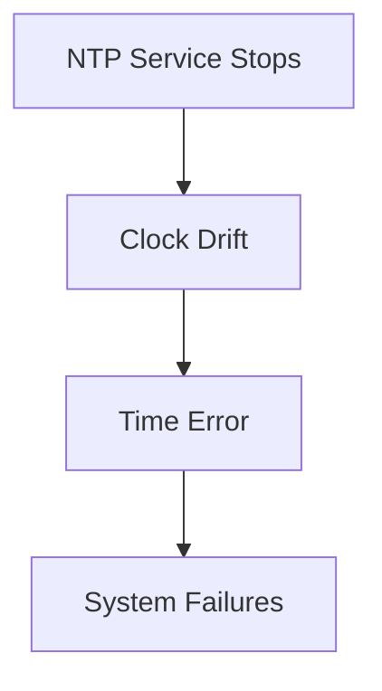

---

# Symptoms

```text
Increasing Clock Drift
Certificate Errors
Authentication Failures
```

---

# Failure 2: Clock Drift

All clocks drift.

Hardware is imperfect.

---

# Drift Visualization

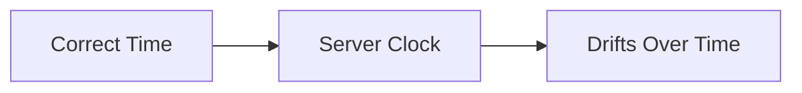

Without synchronization:

```text
Error Accumulates
```

---

# Investigation

Check:

```bash
chronyc tracking
```

or:

```bash
ntpq -p
```

---

# Failure 3: Time Zone Misconfiguration

Very common.

---

# Important Distinction

```text
Time Zone
≠
Time Synchronization
```

Example:

```text
UTC Correct

Timezone Wrong
```

Applications appear broken.

---

# Investigation

```bash
timedatectl
```

---

# Failure 4: Certificate Validation Errors

Most common production impact.

---

# TLS Validation

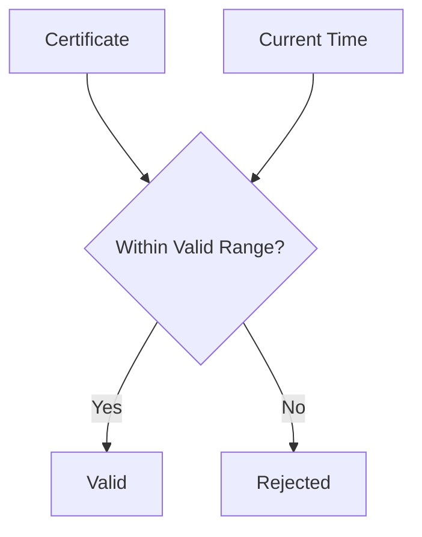

---

# Errors

```text
certificate expired

certificate not yet valid
```

Often caused by:

```text
Wrong System Time
```

---

# Failure 5: JWT Token Failures

JWTs contain:

```text
iat
exp
nbf
```

fields.

---

# JWT Validation Flow

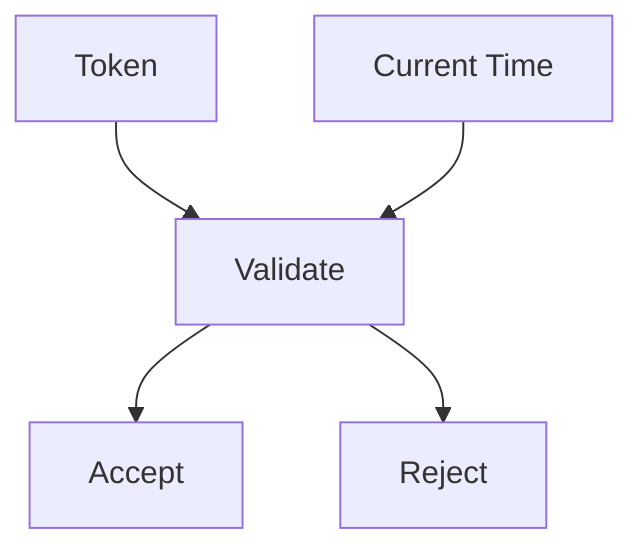

---

# Symptoms

```text
Random Login Failures

Unauthorized Errors

Token Expired Errors
```

---

# Failure 6: Kerberos Authentication Failure

Kerberos requires:

```text
Clock Synchronization
```

usually within:

```text
5 Minutes
```

---

# Kerberos Trust Model


Clock drift:

```text
Authentication Rejected
```

---

# Failure 7: Kubernetes Problems

Kubernetes heavily depends on time.

---

# Kubernetes Time Dependencies

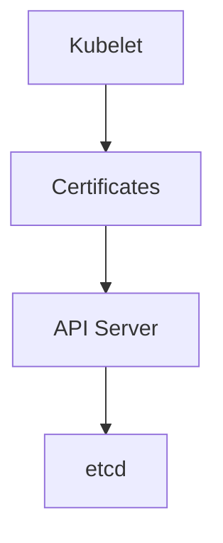

Wrong time can cause:

```text
Node Not Ready
Certificate Errors
Lease Problems
```

---

# Failure 8: Distributed Database Replication

Databases use timestamps.

Examples:

```text
Cassandra
CockroachDB
MongoDB
Spanner
```

---

# Replication Architecture


Clock drift causes:

```text
Write Conflicts
Replication Errors
Consistency Problems
```

---

# Failure 9: Monitoring Failures

Monitoring assumes:

```text
Time Ordered Events
```

---

# Monitoring Pipeline

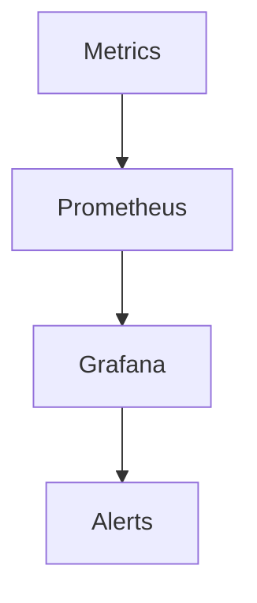

Incorrect timestamps create:

```text
Missing Graphs
False Alerts
Broken Dashboards
```

---

# Failure 10: Log Corruption

Logs become useless.

---

# Example

Correct:

```text
10:00 Error
10:01 Restart
10:02 Recovery
```

Incorrect:

```text
10:02 Recovery
09:59 Restart
10:00 Error
```

Root cause analysis becomes difficult.

---

# Log Timeline Problem

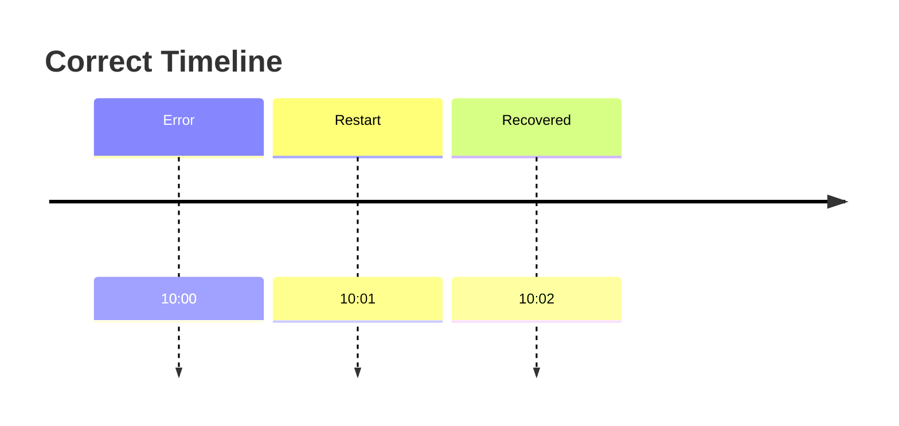

---

# Linux Time Internals

Time is maintained by:

```text
Kernel Clock Source
```

Examples:

```text
TSC
HPET
ACPI
```

---

# Kernel Time Architecture

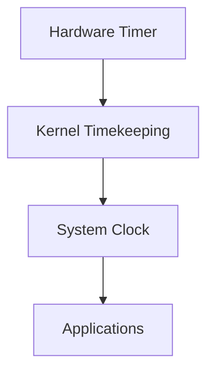

---

# Virtual Machine Time Problems

Common in cloud.

---

# VM Architecture

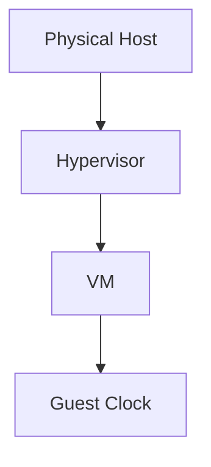

VM pause/resume events can cause:

```text
Time Jumps
```

---

# Container Time

Containers share:

```text
Host Clock
```

Important observation:

```text
Container Time Problems
Usually Host Time Problems
```

---

# Docker Architecture

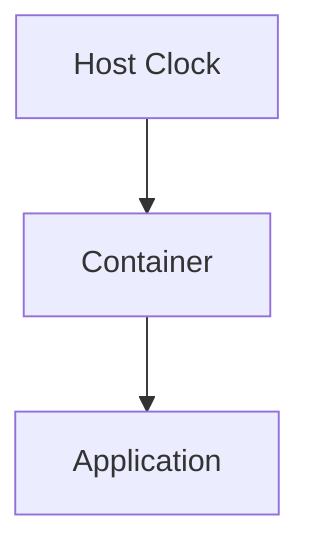

---

# Cloud Infrastructure Example

AWS:

```text
Amazon Time Sync Service
```

Azure:

```text
Azure Host Time Service
```

GCP:

```text
Google Public NTP
```

Cloud providers invest heavily in accurate time.

---

# Production Incident Example

## Incident

Users unable to login.

Error:

```text
JWT Expired
```

Investigation:

```bash
date
```

Result:

```text
Server 18 Minutes Behind
```

Root Cause:

```text
chronyd Stopped
```

Fix:

```bash
systemctl restart chronyd
```

Authentication immediately recovered.

---

# Production Incident Example #2

Kubernetes cluster outage.

Symptoms:

```text
TLS Validation Errors
```

Investigation:

```bash
timedatectl
```

Found:

```text
System Clock 2 Hours Ahead
```

Certificates appeared:

```text
Not Yet Valid
```

Root Cause:

```text
Incorrect Timezone And NTP Configuration
```

---

# Observability

Monitor:

```text
NTP Offset
Clock Drift
Synchronization Status
Time Source Reachability
```

Critical metrics:

```text
Offset
Jitter
Stratum
Sync State
```

---

# Essential Commands

```bash
date

timedatectl

hwclock

chronyc tracking

chronyc sources

ntpq -p

systemctl status chronyd

systemctl status systemd-timesyncd
```

---

# Master Troubleshooting Workflow

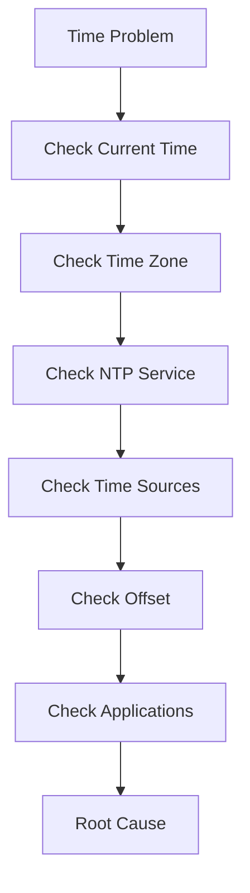

---

# Common Mistakes

## Mistake 1

Ignoring time as a possible cause.

---

## Mistake 2

Confusing timezone with synchronization.

---

## Mistake 3

Disabling NTP.

---

## Mistake 4

Manually setting time repeatedly.

---

## Mistake 5

Ignoring clock drift metrics.

---

## Mistake 6

Assuming cloud VMs always have correct time.

---

# Engineering Mindset

Beginners think:

```text
Time Is A Clock
```

Engineers think:

```text
Time Is A System Service
```

Senior engineers think:

```text
Time Is A Security Dependency
```

Elite distributed systems engineers think:

```text
Time
↓
Trust
↓
Authentication
↓
Replication
↓
Consistency
↓
Distributed Systems
```

Because almost every distributed system eventually asks:

```text
When Did This Event Happen?
```

And if time is wrong:

```text
Everything Built On Trust
Starts To Fail
```

---

# Interview Questions

### What protocol synchronizes Linux clocks?

```text
NTP
```

---

### What command checks synchronization status?

```bash
timedatectl
```

---

### What causes certificate validation failures?

Often:

```text
Incorrect System Time
```

---

### What is clock drift?

Gradual deviation from correct time.

---

### What is stratum?

Distance from reference clock.

---

### Why does Kerberos require synchronized clocks?

To prevent replay attacks.

---

### Do containers have independent clocks?

No.

Containers use host time.

---

# Cheat Sheet

```bash
# Current Time
date

# Detailed Status
timedatectl

# Hardware Clock
hwclock

# Chrony Status
chronyc tracking

# NTP Sources
chronyc sources

# NTP Peers
ntpq -p

# Chrony Service
systemctl status chronyd

# Sync Service
systemctl status systemd-timesyncd
```

---

# Final Takeaway

Time synchronization is not:

```text
A Convenience Feature
```

It is:

```text
Critical Infrastructure
```

The most important lesson:

```text
Time Problems
Rarely Look Like
Time Problems
```

They usually appear as:

```text
TLS Errors
Login Failures
Database Problems
Kubernetes Issues
Monitoring Bugs
Replication Failures
```

The best Linux, SRE, Platform, Cloud, and Distributed Systems engineers always remember:

```text
Correct Time
=
Trust
```

And without trust:

```text
Modern Infrastructure Cannot Function
```
