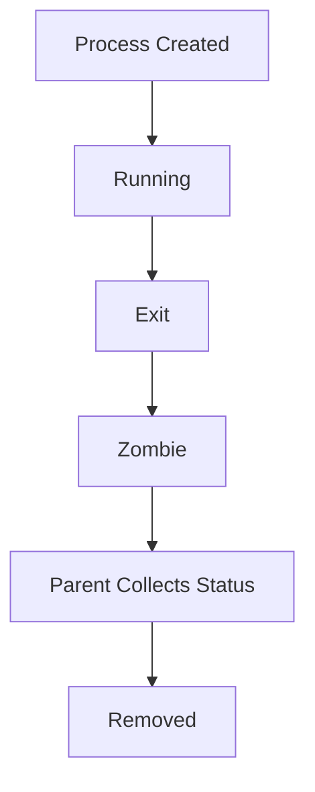
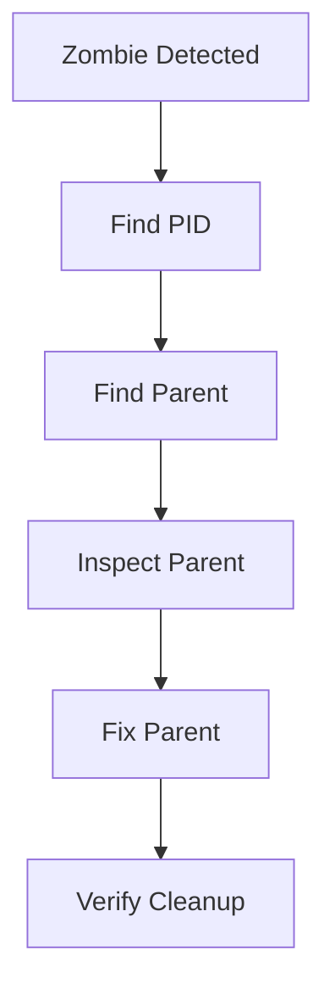

# Zombie Processes Troubleshooting Guide

> One of the most misunderstood Linux process states.
>
> A process that is technically dead but still exists.
>
> A fascinating example of how Linux manages process lifecycle and system resources.

---

# Why This Exists

Most engineers think a process has only two states:

```text
Running
Stopped
```

Reality is much more complex.

Linux processes go through a complete lifecycle:

```text
Created
Running
Waiting
Exiting
Terminated
Cleaned Up
```

Sometimes a process finishes execution but is not fully cleaned up.

The result:

```text
Zombie Process
```

Zombie processes are not usually dangerous individually.

However:

```text
Thousands Of Zombies
```

can eventually:

```text
Exhaust Process Table
Prevent New Processes
Cause System Instability
Reveal Application Bugs
```

Understanding zombies teaches fundamental Linux internals.

---

# Problem It Solves

Imagine an employee resigns.

```text
Employee Gone
```

But HR never removes:

```text
Employee Record
```

from the company database.

The employee no longer works.

Yet the record remains.

Zombie processes are exactly this.

```text
Process Finished
        ↓
Kernel Keeps Record
        ↓
Waiting For Parent
```

---

# Mental Model

A zombie process is:

```text
Dead
But Not Forgotten
```

It consumes:

```text
Almost No Memory
No CPU
No Work
```

But still occupies:

```text
Process Table Entry
PID Information
Exit Status Information
```

The zombie exists because:

```text
Parent Has Not Collected Child Status
```

---

# First Principles

Linux processes form a hierarchy.

Example:

```text
Parent Process
      ↓
Creates Child
      ↓
Child Executes
      ↓
Child Exits
```

When child exits:

```text
Kernel Preserves Exit Status
```

because parent may want:

```text
Exit Code
Termination Reason
Resource Statistics
```

Until parent collects that information:

```text
Zombie Exists
```

---

# Process Lifecycle



The zombie phase is temporary.

Or at least:

```text
It Should Be
```

---

# Formal Definition

A zombie process is:

```text
A Process That Has Exited
But Still Has An Entry
In The Kernel Process Table
```

Linux represents zombies using:

```text
State = Z
```

---

# Why Zombies Exist

Many beginners ask:

```text
Why Not Remove Process Immediately?
```

Because parents need information.

Example:

```c
child exits with code 1
```

Parent may later execute:

```c
wait()
```

to discover:

```text
Exit Code = 1
```

If kernel removed process instantly:

```text
Exit Information Lost
```

---

# Parent-Child Relationship

```mermaid
flowchart TD

A[Parent]

B[Child]

A --> B

B --> C[Child Exits]

C --> D[Zombie]

A --> E[wait()]

D --> E

E --> F[Cleanup]
```

The parent is responsible for cleanup.

---

# What Resources Do Zombies Consume?

This is commonly misunderstood.

Zombie processes do NOT consume:

```text
CPU
Memory
Disk
Network
```

They DO consume:

```text
PID
Process Table Entry
Kernel Metadata
```

---

# Why Too Many Zombies Are Dangerous

One zombie:

```text
Harmless
```

Ten zombies:

```text
Minor Problem
```

Thousands:

```text
Serious Incident
```

Because Linux has finite:

```text
PID Space
Process Table Entries
```

Eventually:

```text
fork()
```

fails.

New processes cannot be created.

---

# Visualizing The Problem

Healthy:

```text
Process Table

PID 100
PID 101
PID 102
PID 103
```

Zombie Flood:

```text
PID 100
PID 101
PID 102
PID 103
PID 104 Z
PID 105 Z
PID 106 Z
PID 107 Z
...
```

Eventually:

```text
No Space Left
```

for new processes.

---

# Identifying Zombies

Check:

```bash
ps aux
```

Example:

```text
USER PID %CPU %MEM STAT COMMAND

root 1234 0.0 0.0 Z apache
```

Important field:

```text
STAT = Z
```

---

# Better Zombie Detection

```bash
ps aux | grep Z
```

Or:

```bash
ps -el | grep Z
```

Output:

```text
Z
```

indicates zombie state.

---

# Understanding Process States

Linux process states:

```text
R = Running

S = Sleeping

D = Uninterruptible Sleep

T = Stopped

Z = Zombie
```

Zombie is unique because:

```text
Process Already Dead
```

---

# Zombie Visualization

```mermaid
flowchart LR

A[Running]

B[Exit]

C[Zombie]

D[wait()]

E[Removed]

A --> B
B --> C
C --> D
D --> E
```

---

# Common Root Causes

---

# Cause 1: Parent Never Calls wait()

Most common.

Buggy application:

```c
fork()
child exits
parent ignores child
```

Result:

```text
Zombie
```

---

# Cause 2: Programming Errors

Example:

```text
Incorrect Process Management
```

Common in:

```text
C
C++
System Daemons
```

---

# Cause 3: Broken Signal Handling

Linux sends:

```text
SIGCHLD
```

when child exits.

Parent should:

```text
Handle Signal
Call wait()
```

Failure:

```text
Zombie Accumulation
```

---

# Cause 4: Defective Daemons

Long-running services:

```text
Web Servers
Backup Agents
Monitoring Agents
```

may repeatedly create zombies.

---

# Cause 5: Container Init Problems

Containers often run:

```text
PID 1
```

directly.

If PID 1 fails to reap children:

```text
Zombie Explosion
```

can occur.

---

# Linux Internals

When child exits:

```text
exit()
```

kernel:

```text
Releases Memory
Releases Files
Releases Resources
```

But keeps:

```text
PID
Exit Status
Accounting Data
```

until parent executes:

```text
wait()
```

or

```text
waitpid()
```

---

# Kernel Perspective

```mermaid
flowchart TD

A[Child Exit]

B[Release Resources]

C[Keep Exit Status]

D[Zombie State]

E[wait()]

F[Remove Process Table Entry]

A --> B
B --> C
C --> D
D --> E
E --> F
```

---

# Finding Zombie Parents

Find zombie:

```bash
ps -el | grep Z
```

Example:

```text
PID 5000
```

Find parent:

```bash
ps -o ppid= -p 5000
```

Output:

```text
4000
```

Now inspect:

```bash
ps -fp 4000
```

This parent is likely the problem.

---

# Why Killing Zombies Doesn't Work

Many engineers try:

```bash
kill -9 PID
```

on zombie.

Nothing happens.

Why?

Because:

```text
Zombie Already Dead
```

There is no running process to kill.

Only metadata remains.

---

# Correct Fix

Fix:

```text
Parent Process
```

not zombie.

Options:

```text
Restart Parent
Fix Application Bug
Reap Child Processes
```

---

# What If Parent Dies?

Linux has a solution.

Orphaned zombies become adopted by:

```text
PID 1
```

Historically:

```text
init
```

Modern Linux:

```text
systemd
```

PID 1 automatically reaps them.

---

# Adoption Flow

```mermaid
flowchart TD

A[Zombie]

B[Parent Dies]

C[systemd PID 1]

D[wait()]

E[Cleanup]

A --> B
B --> C
C --> D
D --> E
```

---

# Container Connection

Containerized environments frequently encounter zombie issues.

Why?

Containers often run:

```text
Single Application
```

as PID 1.

Many applications:

```text
Do Not Reap Children Properly
```

Result:

```text
Zombie Accumulation
```

---

# Docker Best Practice

Use:

```bash
docker run --init
```

or:

```text
tini
```

Benefits:

```text
Proper Child Reaping
```

---

# Kubernetes Connection

Zombie processes inside containers can lead to:

```text
Resource Leaks
PID Exhaustion
Pod Instability
```

Check:

```bash
kubectl exec
```

then:

```bash
ps aux
```

---

# Production Incident Example

## Incident

Node.js service:

```text
Healthy
```

CPU:

```text
Normal
```

Memory:

```text
Normal
```

But:

```text
Unable To Create New Processes
```

Investigation:

```bash
ps -el | grep Z
```

Result:

```text
20,000 Zombies
```

Root Cause:

```text
Child Processes Spawned
Never Reaped
```

Fix:

```text
Patch Process Handling
Deploy New Version
```

---

# Observability

Monitor:

```text
Zombie Count
Process Count
PID Usage
```

Useful commands:

```bash
ps aux

ps -el

pstree

top
```

---

# Performance Considerations

Small zombie counts:

```text
Negligible Impact
```

Large counts:

```text
Process Creation Failure
Fork Failure
PID Exhaustion
```

---

# Security Considerations

Zombie accumulation may indicate:

```text
Malicious Process Creation
Fork Abuse
Compromised Service
```

Monitor unusual growth.

---

# Troubleshooting Workflow



---

# Common Mistakes

## Mistake 1

Trying:

```bash
kill -9 zombie
```

Impossible.

Zombie already dead.

---

## Mistake 2

Treating zombie as root cause.

Zombie is usually:

```text
Symptom
```

Parent bug is root cause.

---

## Mistake 3

Ignoring parent process.

---

## Mistake 4

Ignoring SIGCHLD handling.

---

## Mistake 5

Running containers without proper init.

---

# Engineering Mindset

Beginners see:

```text
Zombie Process
```

and think:

```text
Broken Process
```

Engineers think:

```text
Broken Parent
```

Elite Linux engineers think:

```text
What Failed In
The Parent-Child Lifecycle?
```

because zombies reveal process management bugs.

---

# Interview Questions

### What is a zombie process?

A terminated process whose exit status has not been collected by its parent.

---

### What state represents zombies?

```text
Z
```

---

### Do zombies consume CPU?

No.

---

### Do zombies consume memory?

Almost none.

---

### Why can't you kill a zombie?

Because it is already dead.

---

### What system call removes zombies?

```c
wait()
waitpid()
```

---

### What process adopts orphaned zombies?

```text
PID 1
systemd
```

---

# Cheat Sheet

```bash
# Show Zombies
ps aux | grep Z

# Alternative
ps -el | grep Z

# Find Parent
ps -o ppid= -p PID

# Parent Details
ps -fp PPID

# Process Tree
pstree -p

# System Overview
top

# Count Zombies
ps aux | awk '$8 ~ /Z/ { count++ } END { print count }'
```

---

# Final Takeaway

Zombie processes are one of the best examples of Linux design philosophy.

A zombie is:

```text
Not Running
Not Working
Not Consuming CPU
```

Yet it still exists because Linux preserves information for its parent.

The most important lesson:

```text
Zombie
≠
Problem

Zombie
=
Evidence
```

The real problem is almost always:

```text
A Parent Process
That Failed To Reap
Its Children
```

Understanding that distinction is what separates Linux users from Linux engineers.
